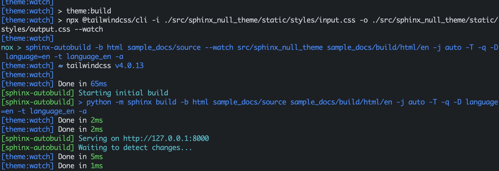

# Usage

{#nox-tasks}

## noxfile tasks

### clean

### build

TODO: builder, language from commandline

### preview

TODO: builder, language from commandline

In preview mode, Python (Sphinx) and Node.js (Tailwind) part runs in parallel. To distinct the terminal output, both are prefixed with their names.

Since they run in parallel, they are independent. It means:

- One may crash and other will continue to run. You must inspect failure yourself.
- Output is mixed. For convenience, processes have different colors.



## package.json tasks

The `package.json` must contain the following `scripts` tasks. They are called by Nox tasks. However, you can add your own additional tasks.

```
{
  "scripts": {
    "theme:build": "...",
    "theme:watch": "..."
  }
}
```

For example, if you want to build just Node.js assets, call `npm run theme:build`.

### theme:build

### theme:watch
