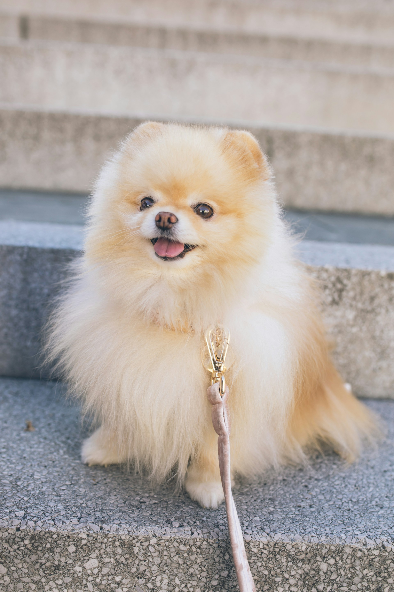

..
   Copyright (c) 2021 Pradyun Gedam
   Licensed under Creative Commons Attribution-ShareAlike 4.0 International License
   SPDX-License-Identifier: CC-BY-SA-4.0

================
Images & Figures
================

Images
------

An image:

A clickable image:

This is a lot of text to go along with a right-aligned image, that is
helping make this content feel less linear. It is important to have such
a body of text, since the image is meant to be "floated" to the right,
which would interfere with the rest of the document otherwise.

Lorem ipsum dolor sit amet consectetur adipisicing elit. Blanditiis
sapiente veritatis doloribus accusantium molestiae modi recusandae
excepturi facere, corrupti expedita sit nihil temporibus eius sequi
animi, illo libero labore fuga.

Lorem ipsum dolor sit amet consectetur adipisicing elit. Blanditiis
sapiente veritatis doloribus accusantium molestiae modi recusandae
excepturi facere, corrupti expedita sit nihil temporibus eius sequi
animi, illo libero labore fuga.

This is a lot of text to go along with a left-aligned image, that is
helping make this content feel less linear. It is important to have such
a body of text, since the image is meant to be "floated" to the right,
which would interfere with the rest of the document otherwise.

Lorem ipsum dolor sit amet consectetur adipisicing elit. Blanditiis
sapiente veritatis doloribus accusantium molestiae modi recusandae
excepturi facere, corrupti expedita sit nihil temporibus eius sequi
animi, illo libero labore fuga.

Lorem ipsum dolor sit amet consectetur adipisicing elit. Blanditiis
sapiente veritatis doloribus accusantium molestiae modi recusandae
excepturi facere, corrupti expedita sit nihil temporibus eius sequi
animi, illo libero labore fuga.

Figures
-------

   A figure is an image with a caption and/or a legend:

   +------------+-----------------------------------------------+
   | re         | Revised, revisited, based on 're' module.     |
   +------------+-----------------------------------------------+
   | Structured | Structure-enhanced text, structuredtext.      |
   +------------+-----------------------------------------------+
   | Text       | Well it is, isn't it?                         |
   +------------+-----------------------------------------------+

   This paragraph is also part of the legend.

A figure directive with center alignment

   This caption should be centered.

Inline images
-------------

.. |EXAMPLE| image:: /_static/favicon.svg
    :width: 1em

Inline image is a small image. Another example of using an inline
image in a sentence. This is an example of an inline image: |EXAMPLE|. 
Inline images can be very useful for adding small icons or symbols.
They help to visually break up text |EXAMPLE| and make it more engaging.
You can use them to represent different concepts or actions.
Inline images should be used |EXAMPLE| sparingly to avoid cluttering the text.
Make sure the images are relevant and add value to the content.
